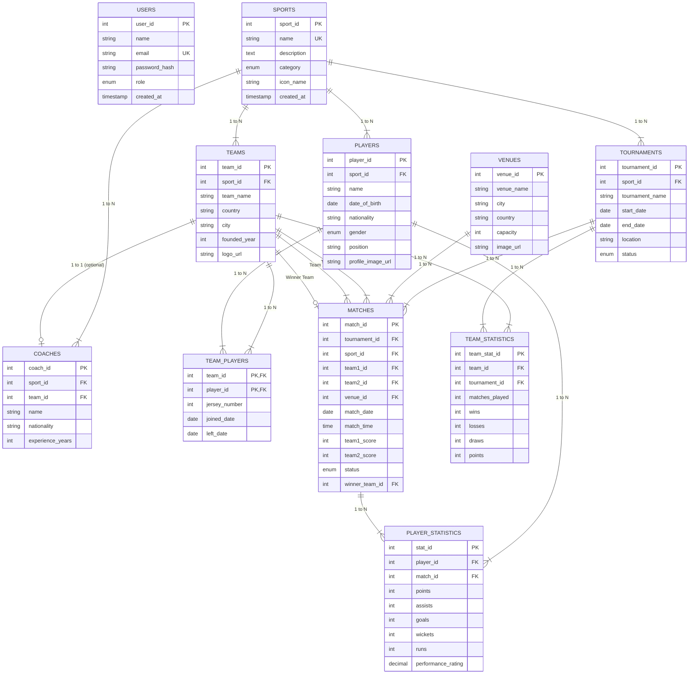

# Entity-Relationship (ER) Diagram & Structural Documentation

## Overview
This document contains the Entity-Relationship (ER) diagram for **SportsHub — Sports Management & Information System**. The database model is designed to 3rd Normal Form (3NF) standards, enforcing strict relational integrity, foreign key constraints, unique constraints, and check constraints.

---

## ER Diagram (Mermaid Diagram)

---

## Entity Explanations & Cardinalities

1. **SPORTS to TEAMS (1 : N)**
   - One sport (e.g., Cricket) can feature many teams (Mumbai Indians, CSK).
   - Each team belongs strictly to one sport category (`sport_id` Foreign Key).

2. **TEAMS to PLAYERS (M : N via `TEAM_PLAYERS`)**
   - A team has multiple players, and over time an athlete can play for multiple teams.
   - Resolved using junction table `team_players` with Composite Primary Key `(team_id, player_id)` to avoid data duplication.

3. **TOURNAMENTS & VENUES to MATCHES (1 : N)**
   - A tournament hosts multiple match fixtures. Each match takes place at a specific venue.

4. **TEAMS to MATCHES (1 : N for Team1, Team2, and Winner)**
   - Each match references two distinct competing teams (`team1_id` & `team2_id`) via `CHECK (team1_id <> team2_id)`.
   - Optional `winner_team_id` FK references the winning team upon match completion.

5. **PLAYERS & MATCHES to PLAYER_STATISTICS (1 : N)**
   - Granular performance metrics (goals, wickets, runs, points) recorded per player per match. Unique constraint `(player_id, match_id)`.
